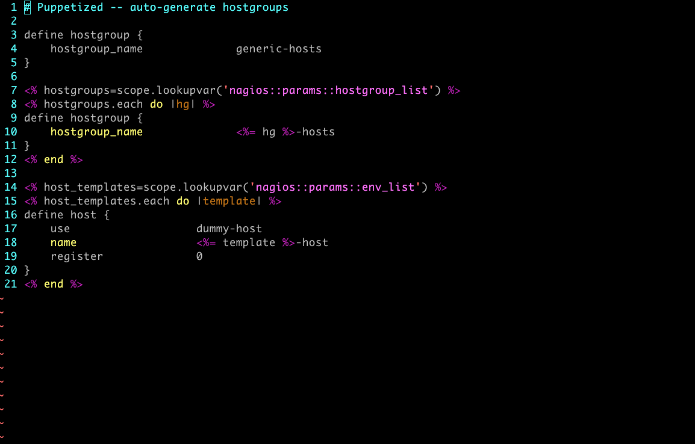

!SLIDE incremental 

# Puppet Features #

* Classes and Modules
* Defines
* Inheritance
* Custom Functions
* Templates

.notes Not enough time

!SLIDE full-page-image 

# Templates

.notes Ruby ERB * Generates configuration file * Using parameters or system facts

