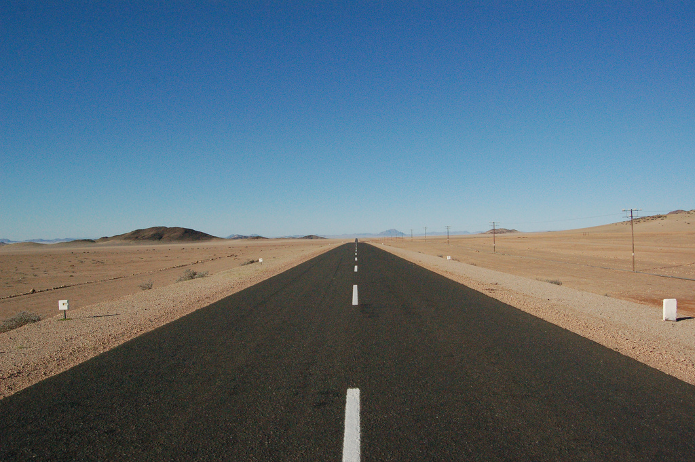

!SLIDE full-page-image title

# The Road Ahead

Image courtesy of <a rel="cc:attributionURL" href="http://www.flickr.com/photos/linss203/">linss203</a> <a rel="license" href="http://creativecommons.org/licenses/by-sa/2.0/">(CC)</a>

!SLIDE incremental

* Scaling and Availability
* Puppetize the Outliers
* Data/Attribute Management
* RightScale to AWS
* Integrated Monitoring
* Node Naming
* DRY Refactoring (w/ TDD?)
* Desktop/Vagrant

!SLIDE full-page-image

Image courtesy of <a rel="cc:attributionURL" href="http://www.flickr.com/photos/thetruthabout/">TheTruthAbout...</a> <a rel="license" href="http://creativecommons.org/licenses/by-sa/2.0/">(CC)</a>

