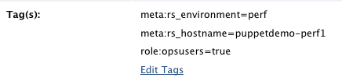
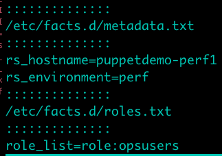
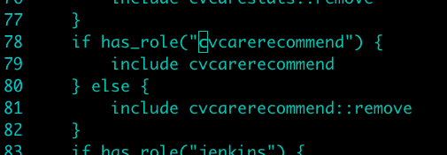

!SLIDE title

# Puppet #

## In Action ##

!SLIDE transition=fade

# Bootstrapping: Tags #

## RightScale Tags

##  Puppet Facts ##

.notes Usually a RightScale instance ends with a run of puppet agent to
complete configuring the host, but in this case we will watch it run.

!SLIDE bullets incremental transition=fade

# Bootstrapping: Agent Run #

* <pre>puppet agent --test</pre>
* Exchange certs with puppetmaster
* Send facts to server
* Receive 'catalog' from server
* Execute the catalog...
* ...Install users, monitoring, MOTD

!SLIDE bullets incremental 

# CV Deployments: initial run #

* <pre>site.pp</pre>: 
* Add 'role:cvcarerecommend' to /etc/facts.d/metadata.txt
* Run 'puppet agent --test'
* Watch the [ScreenCast](http://screencast.com/t/iq17poCZ9)

!SLIDE bullets incremental 

# CV Deployments: new release #

* Bump the version number
* Run puppet
* Verify

