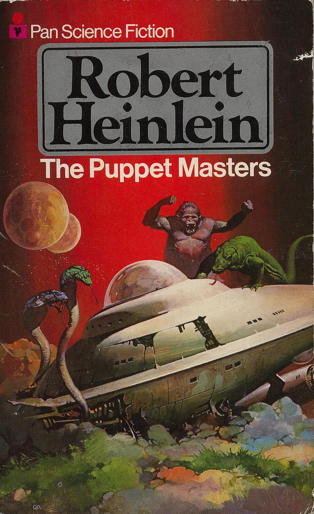

!SLIDE full-page-image title

Image courtesy of <a rel="cc:attributionURL" href="http://www.flickr.com/photos/rappensuncle/">rappensuncle</a> <a rel="license" href="http://creativecommons.org/licenses/by-sa/2.0/">(CC)</a>

# The Puppet Masters of Audax #

## Peter Burkholder ##
